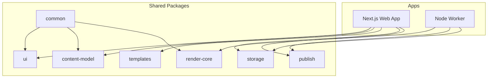

# Guest TV Pages Project Initialization Plan

## Architecture Overview



## Tech Stack

| Layer    | Choice                      | Rationale                                                 |
| -------- | --------------------------- | --------------------------------------------------------- |
| Monorepo | **pnpm + Turborepo**        | Fast, efficient; Turborepo handles task orchestration     |
| Web app  | **Next.js 14 (App Router)** | React-based, API routes, server components per doc        |
| Worker   | **Node.js + tsx**           | Long-running process; Playwright/FFmpeg integration       |
| Database | **SQLite + Drizzle**        | MVP simplicity; straightforward PostgreSQL migration path |
| Styling  | **Tailwind CSS**            | Rapid UI development, CSS variables for theming           |
| Schemas  | **Zod**                     | Strong typing, validation, content-model definitions      |

## Project Structure

```
hospitality-channels/
├── apps/
│   ├── web/                 # Next.js admin UI + API
│   └── worker/              # Render/publish job worker
├── packages/
│   ├── common/              # Shared utilities, config, types
│   ├── content-model/       # Zod schemas, domain models
│   ├── ui/                  # Shared React components
│   ├── templates/           # Page templates + schema
│   ├── storage/             # Asset/filesystem abstraction
│   ├── render-core/         # Playwright capture orchestration
│   └── publish/             # Export profiles, publish logic
├── infrastructure/
│   ├── docker/
│   └── scripts/
├── docs/
└── guest-tv-pages-architecture.md
```

## Implementation Steps

### 1. Monorepo Foundation

- Create root `package.json` with pnpm workspaces
- Add Turborepo config (`turbo.json`) with pipelines for `build`, `dev`, `lint`
- Add root `tsconfig.json` for shared compiler options
- Create `pnpm-workspace.yaml` defining `apps/*` and `packages/*`
- Add `.nvmrc` or `.node-version` for Node 20+

### 2. `packages/common`

- Base package with minimal dependencies (no React)
- Exports: config types, `RENDER_RESOLUTION` (1920x1080), logger, env helpers
- `tsconfig.json` with `"composite": true` for references

### 3. `packages/content-model`

- Zod schemas for: Template, Page, Room, Guest, Asset, PublishProfile, PublishedArtifact, ChannelDefinition
- Entity types inferred from schemas
- Depends on `common`

### 4. `packages/storage`

- Abstract interface: `AssetStorage`, `upload()`, `getPath()`, `listByType()`
- Local filesystem implementation (MVP)
- Depends on `common`, `content-model`

### 5. `packages/templates`

- Template registry with 1–2 starter templates (Welcome, House Guide)
- Declarative schema per template (fields, defaults)
- Depends on `common`, `content-model`

### 6. `packages/render-core`

- Playwright-based capture: load URL at 1920x1080, wait for ready, capture video
- FFmpeg wrapper for normalization, trim, loop polish
- Render mode rules: deterministic, no live clocks, preload assets
- Depends on `common`, `content-model`, `templates`

### 7. `packages/publish`

- `PublishProfile` config (export path, file naming)
- `publishArtifact()` to copy files and write sidecar metadata
- Depends on `common`, `content-model`, `storage`

### 8. `packages/ui`

- React components: 16:9 scene container, TV-safe margins overlay
- Typography tokens, color variables
- Depends on `common`, `content-model` (no Next.js-specific code in shared UI)

### 9. `apps/web` (Next.js)

- Next.js 14 with App Router, TypeScript, Tailwind
- API routes: `/api/templates`, `/api/pages`, `/api/rooms`, `/api/guests`, `/api/assets`, `/api/render`, `/api/publish`
- Pages: Dashboard, Pages list, Page editor with live 1920x1080 preview, Templates, Rooms, Guests, Assets, Publish
- SQLite + Drizzle for DB (migrations in `apps/web/db`)
- Minimal auth placeholder (or skip for MVP per doc)

### 10. `apps/worker`

- Node.js script/entrypoint using `tsx`
- Job queue consumer (in-memory or BullMQ with Redis later)
- Render and publish job handlers using `render-core` and `publish`
- Graceful shutdown, structured logging

### 11. Infrastructure

- `Dockerfile` for web app
- `Dockerfile` for worker
- `docker-compose.yml` with web, worker, SQLite volume (or Postgres if preferred)
- Scripts: `seed.ts`, `migrate.ts`

### 12. Configuration and Tooling

- ESLint + Prettier (shared config in `packages/common` or root)
- `.env.example` with `DATABASE_URL`, `ASSET_STORAGE_PATH`, `EXPORT_PATH`, `NODE_ENV`

## Key Files to Create

| File                                                                                 | Purpose                            |
| ------------------------------------------------------------------------------------ | ---------------------------------- |
| [package.json](package.json)                                                         | Root workspace, scripts, Turborepo |
| [pnpm-workspace.yaml](pnpm-workspace.yaml)                                          | Workspace definition               |
| [turbo.json](turbo.json)                                                             | Build/lint pipelines               |
| [packages/content-model/src/schemas.ts](packages/content-model/src/schemas.ts)       | Core entity schemas                |
| [apps/web/package.json](apps/web/package.json)                                       | Next.js app                        |
| [apps/worker/package.json](apps/worker/package.json)                                 | Worker app                         |
| [infrastructure/docker/docker-compose.yml](infrastructure/docker/docker-compose.yml) | Local dev stack                    |

## Dependencies Summary

**Root:** `turbo`, `typescript`, `@types/node`

**apps/web:** `next`, `react`, `react-dom`, `tailwindcss`, `drizzle-orm`, `better-sqlite3` (or `@libsql/client`), `zod`

**apps/worker:** `playwright`, `fluent-ffmpeg` (or `ffmpeg-static` + child_process), `tsx`, `zod`

**packages/render-core:** `playwright`, `fluent-ffmpeg` or raw `ffmpeg`

**packages/publish:** (minimal; uses Node `fs`)

**packages/storage:** (minimal; uses Node `fs`, `path`)

## Out of Scope for Init (Post-MVP)

- Full auth implementation (local-auth placeholder is fine)
- Redis/BullMQ for production job queue
- PostgreSQL migration (SQLite first)
- S3-compatible storage
- Live HLS or alternative output formats

## Verification

After initialization:

1. `pnpm install` succeeds
2. `pnpm run build` builds all packages and apps
3. `pnpm run dev` starts Next.js dev server
4. Worker can be run with `pnpm --filter worker dev` (or equivalent)
5. Docker Compose brings up web + worker
6. One starter template (Welcome) is available in the template registry
